# Codex SwitchBridge

Codex CLI multi-account switching for Windows, macOS, and Linux.

It provides both a CLI and a VS Code extension.

Codex SwitchBridge is an independent open-source project derived from
[jqknono/codex-account-switch](https://github.com/jqknono/codex-account-switch),
with substantial modifications by `baoshichao001-dev`.

[](https://github.com/baoshichao001-dev/codex-switchbridge/releases)

## Project Structure

```text
packages/
  core/     - Shared logic for account management, auth, quota lookup, import, and export
  cli/      - CLI package published to npm
  vscode/   - VS Code extension
```

## How It Works

- `add` runs `codex login`, then copies `~/.codex/auth.json` to `~/.codex/auth_{name}.json`
- `use` first syncs the latest current account auth back to its saved `auth_{name}.json`, then restores the selected account into `~/.codex/auth.json`, clears any active `model_provider`, and switches Codex CLI back to account mode
- `quota` queries the ChatGPT backend API for live usage data across the 5-hour and 7-day windows
- `refresh` uses the stored `refresh_token` to refresh an expired access token and writes rotated tokens back to the saved account file
- `mode` switches between normal account mode and provider modes such as `provider`, synchronizing both `auth.json` and `config.toml`
- Saved `auth_{name}.json` files can live in a separate directory; if not configured, the default Codex config directory is used

## CLI Installation

The command-line package is named `codex-switchbridge-cli` and installs the
`codex-switchbridge` binary. Release tarballs are available from GitHub
Releases; npm publication is a separate release step.

After downloading the CLI tarball from a GitHub release, install it with:

```bash
npm install --global ./codex-switchbridge-cli-0.1.0.tgz
codex-switchbridge --version
```

Once the package is published to npm, the equivalent registry install is
`npm install --global codex-switchbridge-cli`.

## CLI Demo

Animated CLI usage demo showing `ls`, `use`, and `quota`:



## CLI Commands

| Command | Description |
|---|---|
| `codex-switchbridge add <name>` | Run `codex login` and save the result as a named account |
| `codex-switchbridge list` | List all saved accounts and providers |
| `codex-switchbridge use <name>` | Switch to the specified account and restore account mode |
| `codex-switchbridge mode [name]` | Show the current mode or switch to a provider/account mode |
| `codex-switchbridge remove <name>` | Remove a saved account |
| `codex-switchbridge quota [name]` | Show quota usage for an account |
| `codex-switchbridge current` | Show the current active account or mode |
| `codex-switchbridge refresh [name]` | Refresh the access token for an account |
| `codex-switchbridge export [file]` | Export accounts to a JSON file |
| `codex-switchbridge import <file>` | Import accounts from a JSON file |

You can override the saved-account directory per invocation:

```bash
codex-switchbridge --auth-dir /path/to/accounts list
```

You can also use the environment variable `CODEX_SWITCHBRIDGE_AUTH_DIR`.

CLI diagnostic performance traces are written to `~/.codex/logs/codex-switchbridge-cli.log` only when `--debug` is passed, and are never printed in command output. If `CODEX_HOME` is set, the log file is written under that directory's `logs/`.

## VS Code Extension

Download `codex-switchbridge-0.1.0.vsix` from [GitHub Releases](https://github.com/baoshichao001-dev/codex-switchbridge/releases), then use **Extensions: Install from VSIX...** or:

```bash
code --install-extension codex-switchbridge-0.1.0.vsix
```

### Features

- Activity Bar view with account list and quota details
- Add, remove, switch, import, and export accounts
- Add, switch, move, and remove saved providers from the Providers view
- Mode-aware status bar display for the current account or provider mode
- Token refresh actions for saved accounts
- Background token maintenance that checks saved accounts for tokens expiring within 120 hours
- Background quota refresh that rotates through saved accounts one at a time on a configurable interval
- Shared local quota cache so multiple VS Code windows can reuse recent results before querying again
- Non-blocking **Reload recommended** status-bar action after switching accounts or providers
- Optional shared local history route for Responses-compatible providers
- Explicit, backup-first repair command for older provider-tagged local threads

### Settings

| Setting | Default | Description |
|---|---|---|
| `codex-switchbridge.quotaRefreshInterval` | `30` | Background maintenance interval, in seconds; minimum `5`; each interval checks one saved account for token refresh when enabled and rotates one saved account quota refresh |
| `codex-switchbridge.tokenAutoUpdate` | `true` | Automatically refresh saved account tokens during background timer maintenance when the token is expired or close to expiring |
| `codex-switchbridge.shareHistoryAcrossProviders` | `true` | Keep new account and Responses-compatible provider sessions in one local Codex history bucket |
| `codex-switchbridge.showStatusBar` | `true` | Show the current account quota in the status bar |
| `codex-switchbridge.reloadWindowAfterSwitch` | `statusBar` | Show a non-blocking reload recommendation, never notify, or reload automatically after switching |
| `codex-switchbridge.authDirectory` | `""` | Directory used to save and load `auth_{name}.json`; empty means the default Codex config directory |

### Shared local history

When `codex-switchbridge.shareHistoryAcrossProviders` is enabled, new account
and relay sessions use Codex's built-in `openai` history bucket. Older threads
that were written with a provider-specific ID can be migrated with
**Codex SwitchBridge: Repair Local Shared History**. The extension never
rewrites history during activation. The repair command asks you to stop active
Codex output first, creates backups, and aborts if a rollout changes while it
is being checked. Python 3 is required only for this maintenance command.
See [Shared local history](./docs/shared-history.md) for the repair and safety details.

> Disable or uninstall **Codex Account Switch** before enabling Codex
> SwitchBridge. Both extensions operate on the same local Codex files and
> should not run at the same time.

## Development

```bash
# Install dependencies
npm install

# Build everything
npm run build

# Build individual packages
npm run build:core
npm run build:cli
npm run build:vscode
```

## Publish The VS Code Extension

```bash
# Build the VS Code extension
npm run build:vscode

# Create a VSIX package
npm run package:vscode

# Publish to the Visual Studio Marketplace
# Requires VSCE_PAT to be available in the environment, or pass extra args via npm --
npm run publish:vscode

# Publish a pre-release version to the Visual Studio Marketplace
npm run publish:vscode:preview

# Publish to Open VSX
# Requires an Open VSX token via OVSX_PAT or OPEN_VSX_TOKEN; publishes the prebuilt VSIX and passes args via npm --
npm run publish:vscode:openvsx
```

Examples:

```bash
npm run publish:vscode -- --pat <your-pat>
npm run publish:vscode -- patch
npm run publish:vscode:preview -- patch
npm run publish:vscode:openvsx -- -p <your-openvsx-token>
```

Before the first Open VSX publish, create the `baoshichao001-dev` namespace if it does not already exist:

```bash
npx ovsx create-namespace baoshichao001-dev -p <your-openvsx-token>
```

## Publish The CLI To npm

```bash
# Build the CLI package
npm run build:cli

# Verify local npm publish prerequisites
npm run publish:cli:check

# Rehearse the local release flow without publishing
npm run verify:publish:cli

# Publish the CLI package to npm
npm run publish:cli
```

Examples:

```bash
# Check whether the local npm account can publish
npm run publish:cli:check

# Show release helper usage
npm run publish:cli:help

# Dry-run a specific committed CLI version
npm run verify:publish:cli -- -Version 0.1.0

# Publish a specific committed CLI version
npm run publish:cli -- -Version 0.1.0
```

The CLI package is now published directly from the local machine. Use `npm login` or a local npm token before publishing. Stable versions default to the `latest` dist-tag, and pre-release versions default to `next`.

## Data Storage

Each saved account is stored as `auth_{name}.json` inside the configured account directory. By default this is the Codex config directory, typically `~/.codex`. Before any account or provider switch overwrites `~/.codex/auth.json`, the tool first syncs the latest current account auth back to its matching saved `auth_{name}.json`. Switching accounts then restores the selected file into `~/.codex/auth.json` and clears the active `model_provider` in `~/.codex/config.toml`.

When `refresh` rotates tokens for a saved account, the updated auth payload is written back to the saved account file. If that account is currently active, `~/.codex/auth.json` is updated too so future switches do not restore an older refresh token snapshot.

Quota refresh is read-only. The CLI `quota` command and the VS Code background/manual quota refresh paths do not refresh tokens, do not rewrite saved auth payloads, and only cache quota results locally on the current machine.

In the VS Code extension, background maintenance separately checks one saved account per timer step. If the access token is expired, within `120` hours of expiry, or a decodable refresh token is within `120` hours of expiry, the extension refreshes that account token before continuing with the independent quota step. Cloud token refresh is not limited to a selected device.

Some tools and extensions that depend on `~/.codex/auth.json` may cache authentication state on startup. For those cases, replacing `auth.json` alone may not take effect immediately, and a VS Code window reload is required.

Provider modes are stored separately as `provider_{name}.json`. A provider profile contains the raw auth payload to write into `auth.json` plus the provider block that should be synchronized into `config.toml`. Export files still only include saved accounts.
