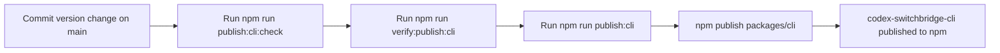

# Deployment

## Release Paths

| Target | Package | Trigger | Credentials | Notes |
| --- | --- | --- | --- | --- |
| npm | `packages/cli` | Local `npm run publish:cli` | Local npm login or token | `packages/cli/package.json` version must match the intended publish version. Stable versions default to `latest`; pre-release versions default to `next`. |
| Visual Studio Marketplace | `packages/vscode` | Local `npm run publish:vscode` | `VSCE_PAT` | Rebuilds the extension, packages the current version, then publishes that exact VSIX. |
| Open VSX | `packages/vscode` | Local `npm run publish:vscode:openvsx` | `OVSX_PAT` or `OPEN_VSX_TOKEN` | Publishes the prebuilt VSIX. |

## npm Local Publish Flow



## npm Local Credentials

Publish from a local environment that already has npm credentials configured.

| Field | Value |
| --- | --- |
| Package | `codex-switchbridge-cli` |
| Registry | `https://registry.npmjs.org` |
| Authentication | `npm login` or a local npm token |
| Recommended branch | `main` |

Check the active npm account with:

```bash
npm whoami
```

Verify registry connectivity with:

```bash
npm ping
```

## Visual Studio Marketplace Procedure

Create or confirm the manifest publisher in the [Visual Studio Marketplace publisher manager](https://marketplace.visualstudio.com/manage/publishers/) before the first release. The publisher ID must match `packages/vscode/package.json`.

Set `VSCE_PAT` in the publishing shell without passing it as a command-line argument, then run:

```bash
npm run publish:vscode
```

The pre-publish hook runs the full extension package command. The publisher script reads the current package version and passes only `codex-switchbridge-<version>.vsix` to `vsce`, so older VSIX files in the working directory cannot be selected accidentally.

## CLI Release Procedure

| Step | Command | Verification |
| --- | --- | --- |
| Install dependencies | `npm ci` | command succeeds |
| Check local publish prerequisites | `npm run publish:cli:check` | script confirms `npm whoami` and `npm ping` succeed, then shows the detected default dist-tag |
| Rehearse the local publish flow | `npm run verify:publish:cli` | runs the CLI release tests and finishes with `npm publish --dry-run` |
| Run CLI release tests | `npm run test -w packages/cli` | the publishable CLI package passes its integration suite |
| Confirm target version | `node -p "require('./packages/cli/package.json').version"` | version is the one you intend to publish |
| Trigger release | `npm run publish:cli` | publishes `packages/cli` directly to npm |
| Verify published package | `npm view codex-switchbridge-cli version` | npm reports the new version |

## Rollback

| Situation | Action |
| --- | --- |
| `npm whoami` or `npm ping` fails | Refresh local npm credentials, then rerun `npm run publish:cli:check`. |
| Dry-run failed before publish | Fix the package/test/auth issue, then rerun `npm run verify:publish:cli`. |
| Incorrect package already published | Publish a corrective version; do not overwrite an existing npm version. |
