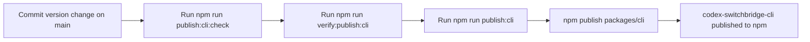

# Deployment

## Release Paths

| Target | Package | Trigger | Credentials | Notes |
| --- | --- | --- | --- | --- |
| npm | `packages/cli` | Local `npm run publish:cli` | Local npm login or token | `packages/cli/package.json` version must match the intended publish version. Stable versions default to `latest`; pre-release versions default to `next`. |
| GitHub and Visual Studio Marketplace | `packages/vscode` | Package-once procedure below | GitHub CLI login and Marketplace publisher access | Uploads one verified VSIX and its checksum without rebuilding between destinations. |
| Open VSX | `packages/vscode` | Local `npm run publish:vscode:openvsx` | `OVSX_PAT` or `OPEN_VSX_TOKEN` | Rebuilds and publishes the current version. |

## npm Local Publish Flow



## npm Local Credentials

Publish from a local environment that already has npm credentials configured.

| Field | Value |
| --- | --- |
| Package | `codex-switchbridge-cli` |
| Registry | `https://registry.npmjs.org` |
| Authentication | `npm login` or a local npm token |
| Recommended branch | `main` |

Check the active npm account with:

```bash
npm whoami
```

Verify registry connectivity with:

```bash
npm ping
```

## VS Code 0.8.2 release procedure

GitHub Actions verifies pushes and pull requests but does not publish releases. Run this procedure from a clean, current `main` checkout after CI passes. The public extension identity is `ShawBob001.codex-routesync`, and its direct Marketplace page is [Codex RouteSync](https://marketplace.visualstudio.com/items?itemName=ShawBob001.codex-routesync).

Fetch remote tags, confirm that 0.8.2 is unused, then package and verify one VSIX. Copy it to a temporary release directory before calculating its checksum; all uploads below use that immutable copy.

```bash
git fetch origin --tags
git switch main
git pull --ff-only origin main
test -z "$(git status --porcelain)"
test -z "$(git tag --list v0.8.2)"
gh auth status
gh repo view ShawBob001/codex-routesync --json nameWithOwner >/dev/null
if gh release view v0.8.2 --repo ShawBob001/codex-routesync >/dev/null 2>&1; then
  echo "v0.8.2 already exists" >&2; exit 1
fi
npm ci
npm run verify
npm run package:vscode

RELEASE_DIR="$(mktemp -d)"
RELEASE_VSIX="$RELEASE_DIR/codex-routesync-0.8.2.vsix"
RELEASE_CHECKSUM="$RELEASE_DIR/codex-routesync-v0.8.2-SHA256SUMS"
cp packages/vscode/codex-routesync-0.8.2.vsix "$RELEASE_VSIX"
unzip -t "$RELEASE_VSIX"
unzip -p "$RELEASE_VSIX" extension/package.json > "$RELEASE_DIR/extension-package.json"
node -e 'const m=require(process.argv[1]); if (m.publisher!=="ShawBob001" || m.name!=="codex-routesync" || m.version!=="0.8.2") process.exit(1)' "$RELEASE_DIR/extension-package.json"
! unzip -Z1 "$RELEASE_VSIX" | rg -q '(^|/)(\.env[^/]*|\.npmrc|test|src)(/|$)'
(cd "$RELEASE_DIR" && sha256sum codex-routesync-0.8.2.vsix > codex-routesync-v0.8.2-SHA256SUMS)
(cd "$RELEASE_DIR" && sha256sum --check codex-routesync-v0.8.2-SHA256SUMS)
```

Do not run `npm run publish:vscode` or `npm run publish:vscode:openvsx` after calculating the checksum because those commands package again. Create a tag from the verified commit and a draft GitHub release containing only the VSIX and checksum, then verify a fresh download.

```bash
git tag -a v0.8.2 -m "Codex RouteSync 0.8.2"
git push origin v0.8.2
sed -n '/^## 0\.8\.2 /,/^## 0\.8\.1 /p' packages/vscode/CHANGELOG.md | sed '$d' > "$RELEASE_DIR/release-notes.md"
gh release create v0.8.2 \
  "$RELEASE_VSIX" \
  "$RELEASE_CHECKSUM" \
  --draft \
  --verify-tag \
  --title "Codex RouteSync 0.8.2" \
  --notes-file "$RELEASE_DIR/release-notes.md"
VERIFY_DIR="$(mktemp -d)"
gh release download v0.8.2 \
  --dir "$VERIFY_DIR" \
  --pattern 'codex-routesync-0.8.2.vsix' \
  --pattern 'codex-routesync-v0.8.2-SHA256SUMS'
(cd "$VERIFY_DIR" && sha256sum --check codex-routesync-v0.8.2-SHA256SUMS)
test "$(gh release view v0.8.2 --json assets --jq '.assets | map(.name) | sort | join(" ")')" = "codex-routesync-0.8.2.vsix codex-routesync-v0.8.2-SHA256SUMS"
```

Open the [Visual Studio Marketplace publisher manager](https://marketplace.visualstudio.com/manage/publishers/) and upload `$RELEASE_VSIX` to `ShawBob001`. Do not rename, rebuild, or download a replacement first. Keep Marketplace credentials out of the repository and command history. After Marketplace processing finishes, verify the public record and install the public identity:

```bash
npx --yes @vscode/vsce@3.9.2 show ShawBob001.codex-routesync --json
code --install-extension ShawBob001.codex-routesync --force
code --list-extensions --show-versions | rg '^ShawBob001\.codex-routesync@0\.8\.2$'
```

Publish the GitHub draft only after the Marketplace page reports 0.8.2 and the downloaded GitHub assets pass their checksum.

```bash
gh release edit v0.8.2 --draft=false
gh release view v0.8.2 --json url,tagName,isDraft,assets
```

## CLI Release Procedure

| Step | Command | Verification |
| --- | --- | --- |
| Install dependencies | `npm ci` | command succeeds |
| Check local publish prerequisites | `npm run publish:cli:check` | script confirms `npm whoami` and `npm ping` succeed, then shows the detected default dist-tag |
| Rehearse the local publish flow | `npm run verify:publish:cli` | runs the CLI release tests and finishes with `npm publish --dry-run` |
| Run CLI release tests | `npm run test -w packages/cli` | the publishable CLI package passes its integration suite |
| Confirm target version | `node -p "require('./packages/cli/package.json').version"` | version is the one you intend to publish |
| Trigger release | `npm run publish:cli` | publishes `packages/cli` directly to npm |
| Verify published package | `npm view codex-switchbridge-cli version` | npm reports the new version |

## Rollback

| Situation | Action |
| --- | --- |
| `npm whoami` or `npm ping` fails | Refresh local npm credentials, then rerun `npm run publish:cli:check`. |
| Dry-run failed before publish | Fix the package/test/auth issue, then rerun `npm run verify:publish:cli`. |
| Incorrect package already published | Publish a corrective version; do not overwrite an existing npm version. |
