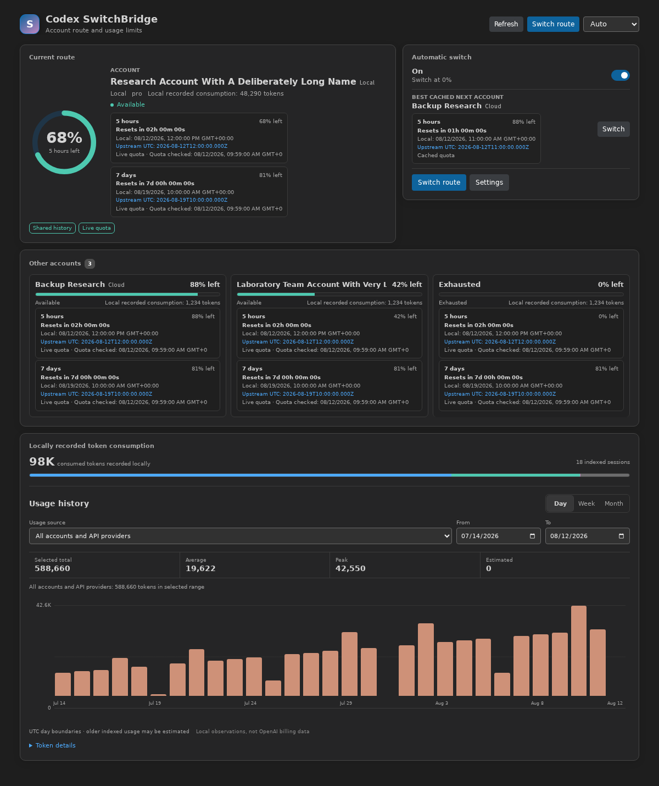
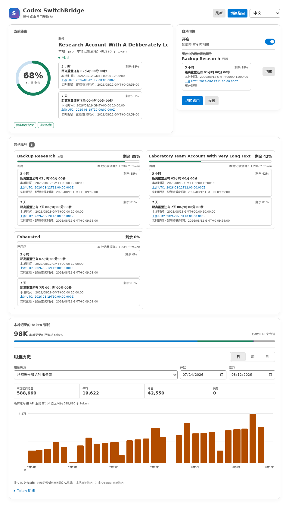

# Codex SwitchBridge for VS Code

**Switch between saved Codex accounts and Responses-compatible API providers with one click, keep local conversation history available in both modes, and track local token usage by selection.**

Codex SwitchBridge manages the active credentials, provider route, and saved selection as one guarded transition. Shared conversation history is enabled by default for new local threads.

## Usage preview

Open **Codex SwitchBridge** from the Activity Bar. One unified **Accounts & API Routes** tree handles both route types, while the central Dashboard opens or focuses automatically.



Switch the Dashboard language to **简体中文** at any time:



## Install

Install the extension from the [Visual Studio Marketplace](https://marketplace.visualstudio.com/items?itemName=baoshichao001-dev.codex-switchbridge). You can also open Extensions in VS Code and search for `Codex SwitchBridge` or `@id:baoshichao001-dev.codex-switchbridge`.

For offline installation, download the latest `.vsix` from [GitHub Releases](https://github.com/baoshichao001-dev/codex-switchbridge/releases), then run **Extensions: Install from VSIX...**. To use the terminal instead, run the command below. Replace VERSION with the version in the downloaded filename.

```bash
code --install-extension codex-switchbridge-VERSION.vsix
```

Disable or uninstall **Codex Account Switch** before enabling Codex SwitchBridge. Both extensions write the same local Codex files.

## Account and API-provider switching

Open **Codex SwitchBridge** from the Activity Bar. The unified **Accounts & API Routes** tree appears in the sidebar, and the graphical Dashboard automatically opens or returns to the foreground in the central editor area. The explicit **Open Dashboard** action remains available as a fallback.

| When you select | SwitchBridge applies |
| --- | --- |
| A Codex account | Saved account credentials, account routing, and the original OpenAI base URL |
| An API provider | Saved API authentication, provider configuration, and the shared-history route |

Before applying the next selection, SwitchBridge writes the latest active credentials back to the outgoing saved entry. It uses atomic authentication writes, a cross-window switch lock, and rollback snapshots.

After a successful switch, the Codex extension may still hold its old authentication in memory. The default **Reload recommended** status-bar action lets you reload when needed without repeated notification popups.

## Dashboard, quota reset time, and local token usage

The Dashboard displays the remaining percentage for every quota window returned for the current and saved accounts, including accounts that expose only a 7-day window. Each window includes a live countdown to the second, local date and time with seconds and time-zone offset, and the exact upstream UTC timestamp. Available earned rate-limit resets are shown when the account service provides them. Missing, invalid, or due reset times are labeled explicitly instead of being estimated.

The Dashboard also indexes cumulative `token_count` events from local Codex rollout files under the active `CODEX_HOME`. It displays the recorded total, input, output, cached input, reasoning output, attributed and unattributed usage, plus a breakdown for every tracked account and API provider. The orange history chart groups activity by day, week, or month; it supports source and date filters and shows the selected total, average, peak, and estimated amount.

The header language selector supports **Auto**, **English**, and **简体中文**. Auto follows the VS Code display language; explicit choices take effect immediately and persist without a window reload. VS Code command, view, welcome, and setting text is also localized in English and Simplified Chinese.

SwitchBridge assigns each new token increment to the selection active when Codex recorded it, even if one conversation continues across an account/API switch. Per-selection tracking begins locally after this version is activated. Older shared `openai` sessions cannot be assigned safely and appear as **Earlier or unattributed**; uniquely identifiable older provider sessions can still be mapped to their saved profile.

The dashboard is an activity view, not a bill or cost estimate. The account service supplies remaining percentages rather than an absolute remaining-token allowance; API-provider routes expose only locally recorded token use unless the provider offers a compatible quota API. Older activity that cannot be dated exactly is marked estimated or kept outside the chart. Cached input is included in input, and reasoning output is included in output. Account quota requests and OAuth token refresh use `codex-switchbridge.proxy`, VS Code's `http.proxy`, or the extension-host proxy environment in that order; environment resolution honors `NO_PROXY`. The dedicated setting is machine-scoped and excluded from Settings Sync. VS Code stores its value in local settings, so prefer an unauthenticated local proxy or protect the settings file if the URL contains credentials. Index data remains on this device and contains counters, timestamps, fingerprints, and opaque IDs, not conversation text, file paths, labels, provider names, or credentials. Run **Refresh Local Token Usage** for an immediate rescan.

## Shared conversation history

With `codex-switchbridge.shareHistoryAcrossProviders` enabled, account mode and Responses-compatible API-provider mode use the same local Codex history bucket under one `CODEX_HOME`. New threads remain visible when you move between the two modes.

This is local history continuity. It does not merge ChatGPT web history, Codex Cloud tasks, connectors, quotas, or history between devices.

Shared routing requires an API provider with:

```toml
wire_api = "responses"
base_url = "https://your-provider.example/v1"
```

### Repair older threads

Older threads may carry a provider-specific history ID. Stop active Codex output, then run **Codex SwitchBridge: Repair Shared Conversation History**.

The repair process creates backups, updates only provider identity fields, validates rollout JSONL and SQLite records, and stops if a rollout changes while it is being checked. Activation never rewrites history. Python 3 is required only for this maintenance command.

See [Conversation history across modes](https://github.com/baoshichao001-dev/codex-switchbridge/blob/main/docs/shared-history.md) for details.

## Features

- One-click switching between saved Codex accounts and API providers
- Shared local conversation history across both modes, enabled by default for new threads
- Local or VS Code Settings Sync storage for accounts and provider profiles
- Account quota display in the tree and status bar
- Wide editor Dashboard with graphical quota, precise reset clocks, and filterable daily/weekly/monthly local token history
- Immediate English/Simplified Chinese Dashboard switching and localized VS Code contributions
- Manual token refresh and rotating background token maintenance
- Shared local quota cache across VS Code windows
- Optional encryption for saved authentication data
- Account import and export
- Explicit, backup-first repair for older provider-tagged threads

## Commands

- `Codex SwitchBridge: Add Account`
- `Codex SwitchBridge: Add API Provider`
- `Codex SwitchBridge: Switch Account`
- `Codex SwitchBridge: Switch API Provider`
- `Codex SwitchBridge: Switch Mode`
- `Codex SwitchBridge: Refresh Token`
- `Codex SwitchBridge: Refresh Quota`
- `Codex SwitchBridge: Refresh Local Token Usage`
- `Codex SwitchBridge: Import Accounts`
- `Codex SwitchBridge: Export Accounts`
- `Codex SwitchBridge: Repair Shared Conversation History`
- `Codex SwitchBridge: Reload Window`

## Settings

| Setting | Default | Description |
| --- | --- | --- |
| `codex-switchbridge.language` | `auto` | Follow VS Code or use English/Simplified Chinese in the Dashboard |
| `codex-switchbridge.proxy` | `""` | Machine-only HTTP(S) proxy for account quota requests and OAuth token refresh; excluded from Settings Sync; empty uses VS Code and extension-host proxy settings |
| `codex-switchbridge.shareHistoryAcrossProviders` | `true` | Keep new local conversation history available across account and Responses-compatible API-provider modes |
| `codex-switchbridge.reloadWindowAfterSwitch` | `statusBar` | Show a non-blocking reload action, never notify, or reload automatically after a switch |
| `codex-switchbridge.quotaRefreshInterval` | `30` | Check one saved account per interval for token maintenance and quota refresh |
| `codex-switchbridge.tokenAutoUpdate` | `true` | Refresh saved account tokens when they are expired or near expiry |
| `codex-switchbridge.showStatusBar` | `true` | Show current selection, quota, token usage, and reload recommendations in the status bar |
| `codex-switchbridge.authDirectory` | `""` | Store local saved entries in this directory; empty uses the default Codex directory |
| `codex-switchbridge.defaultSaveTarget` | `local` | Save new accounts and API providers locally or in synced extension storage |

## Requirements and scope

- Codex CLI must be installed and available to the VS Code extension host.
- Each Codex account must complete a successful `codex login` flow before it can be saved.
- Shared history applies only to local threads under the same `CODEX_HOME`.
- Only Responses-compatible API providers can use the shared-history route.
- Existing Codex output must stop before history repair runs.

## Project

- [Repository](https://github.com/baoshichao001-dev/codex-switchbridge)
- [Issues](https://github.com/baoshichao001-dev/codex-switchbridge/issues)
- [Releases](https://github.com/baoshichao001-dev/codex-switchbridge/releases)

Codex SwitchBridge is an independent open-source project derived from [jqknono/codex-account-switch](https://github.com/jqknono/codex-account-switch), with substantial modifications by `baoshichao001-dev`.

Released under the MIT License.
